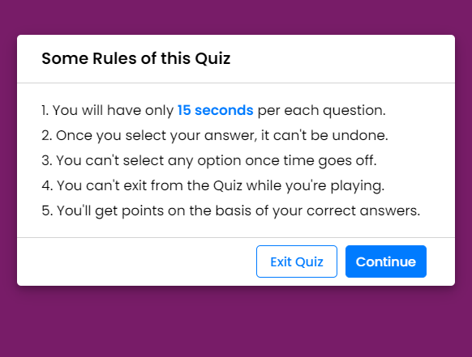
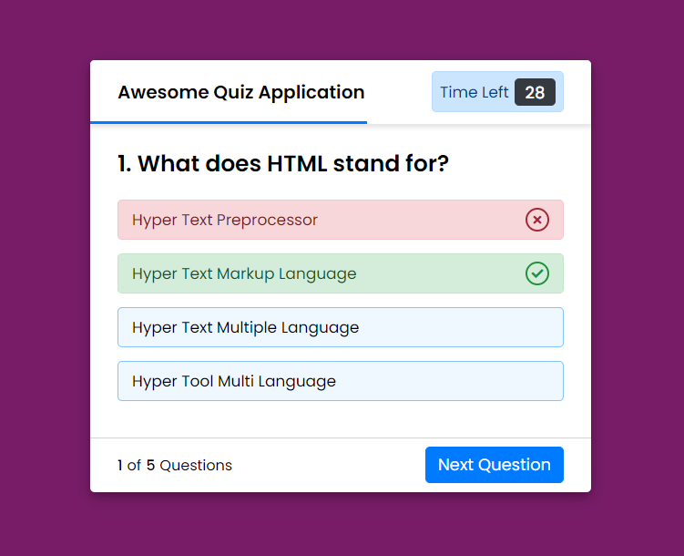

# Quiz App with Timer

This is a simple Quiz App with a built-in timer, developed using HTML, CSS, and JavaScript. It allows users to test their knowledge by answering multiple-choice questions within a specified time limit.

## Features
1. Start the quiz by clicking the "Start Quiz" button.

  

2. Read each question carefully and select the appropriate answer(s).

  

4. Observe the countdown timer and submit your answers before it reaches zero.
5. Immediate feedback on correct and incorrect answers

  

5. Overall score calculation
6. Option to restart the quiz

  

## How to Use

1. Clone the repository or download the source code.
2. Open the `index.html` file in a web browser.
3. Start the quiz by clicking the "Start Quiz" button.
4. Read each question carefully and select the appropriate answer(s).
5. Observe the countdown timer and submit your answers before it reaches zero.
6. After submitting the answers, you will receive immediate feedback and see your overall score.
7. If you wish to retake the quiz, click the "Restart Quiz" button.

## Customization

- You can customize the questions, answers, and timer settings by modifying the `questions.js` file.
- To add or remove questions, edit the array of question objects in the `questions.js` file. Each question object should include the question text, an array of answer options, and an array of correct answer indices.
- Adjust the timer duration by modifying the `timerDuration` variable in the `script.js` file.

## Compatibility

This Quiz App is designed to work on modern web browsers, including Chrome, Firefox, Safari, and Edge. It is responsive and can be accessed on both desktop and mobile devices.

## Credits

This Quiz App was created by ME. It utilizes the following resources:

- HTML
- CSS
- JavaScript

## License

[MIT license]

Feel free to customize and adapt this Quiz App according to your needs. Contributions and feedback are always welcome.

Enjoy the Quiz and have fun testing your knowledge!
